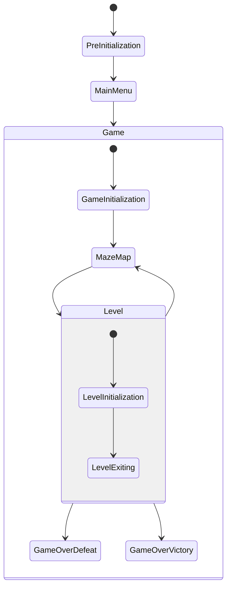

# PhaseEvents 的响应

## 快速开始

本项目使用 GamePhaseSystem 发送全局事件，各系统响应事件，来实现游戏阶段的切换。

## 事件

事件：相关的事件有六个

- OnEnterPhaseEarlyEvent
- OnEnterPhaseEvent
- OnEnterPhaseLateEvent
- OnEnterPhaseEarlyEvent
- OnEnterPhaseEvent
- OnEnterPhaseLateEvent

可以看到，切换分为三个时段，原则上每个时段的职责如下：

- EarlyEvent：配置数据(如 model)
- Event：什么都可以干
- LateEvent：显示表现层

## 职责

游戏的核心进程需要几个System来管理，这些System都实现了接口IPhaseCore（这个接口目前没有作用，仅用于标记）

