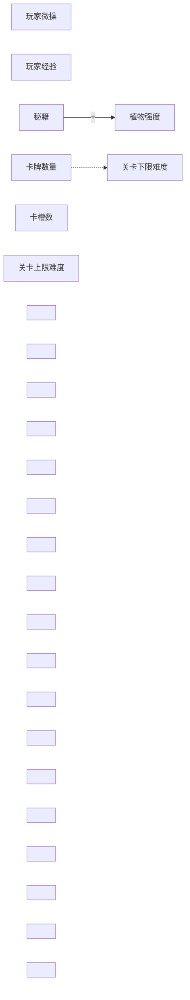

```mermaid
flowchart LR
A["玩家微操"]
B["玩家经验"]
C["秘籍"]
D["植物强度"]
E["卡牌数量"]
F["卡槽数"]
G["关卡上限难度"]
H["关卡下限难度"]

C--+-->D;
E-.->H;


I[" "]
J[" "]
K[" "]
L[" "]
M[" "]
N[" "]
O[" "]
P[" "]
Q[" "]
R[" "]
S[" "]
T[" "]
U[" "]
V[" "]
W[" "]
X[" "]
Y[" "]
Z[" "]
```
